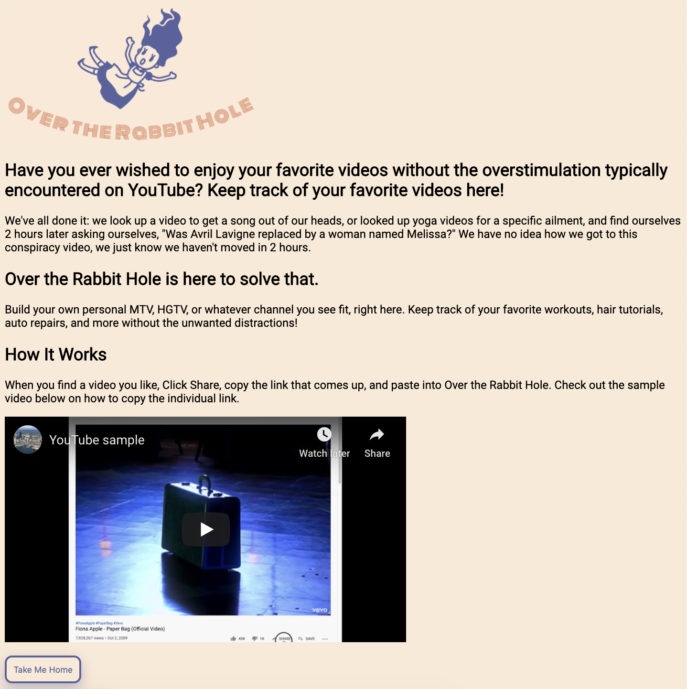

# Over the Rabbit Hole
## By: Melaina Valentine
### For: General Assembly Software Engineering Immersive - Remote Program
---
#### Description
This is the final, independent project completed in General Assmebly's Software Engineering Immersive program and it covers building an app using Django, Django Templating, and Google OAuth. This project also features some HTML and CSS for layout and styling.

_Over the Rabbit Hole_ (OTRH) is a browser-based app where users can create "playlists" of YouTube videos without all the distractions of YouTube. The layout is intentionally simple to help facilitate this goal.

#### User Stories
_ORTH_ was designed with everyone in mind. The following user stories were taken into consideration when building the OTRH app:

- As a person who is easily distracted, I want to enjoy YouTube without further temptation so that I can enjoy the desired content.
- As a car-/homeowner, I want to be able to easily keep track of the repair/home improvement videos I've chosen for future reference so that I can remain focused on my original goal.
- As a current student, I want to keep track of all my helpful tutorial videos without further diversions so that I may complete my assignments efficiently, on time.

#### Wireframes

#### Current Features & Future Goals
This app features full CRUD capability for all end users who create an account, either through OTRH directly, or by authorizing use of their Google account logins instead.

Future goals for this app include:
- Updates to CSS
- Merging logins and user accounts
- Allowing users to choose other external sources for account creation such as Facebook, Twitter, or GitHub

#### Technologies Used

- Django
- Heroku
- HTML
- CSS

#### Getting Started
Please visit https://otrh.herokuapp.com/ to experience the app. 